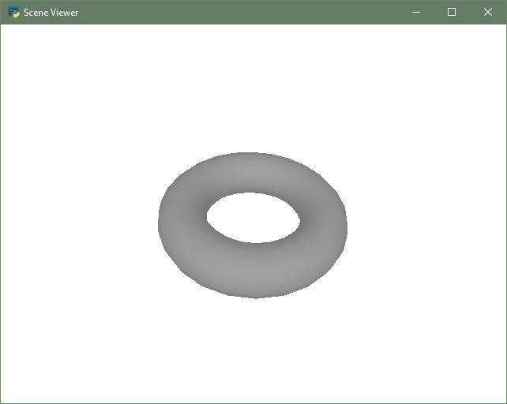

# Python - Coding Framework

## Installation   
1. Download and install [anaconda with python 3](https://www.anaconda.com/distribution/#download-section)

2. Open Anaconda environment  
    Windows  
    + [Anaconda Prompt]( https://docs.anaconda.com/anaconda/user-guide/faq/#installing-anaconda )  
    + [Anaconda Prompt-getting-started]( https://docs.anaconda.com/anaconda/user-guide/getting-started/ )
    
    Linux/OSX  
    + option 1 [Manually init]( https://docs.anaconda.com/anaconda/user-guide/faq/#installing-anaconda )  
        * first run source <path to conda>/bin/activate and then run conda init.  
    + option 2 [Add to PATH]( https://askubuntu.com/questions/760311/anaconda-i-have-to-type-export-path-anaconda3-bin-path-everytime-i-rerun )
    
3. cd to this repository `tutorials/coding_framework/python`
4. Create a new virtual environment geo_tutorials    
`conda create -n  geo_tutorials  python=3.9  pip  notebook  jupyter  matplotlib  `  

5. Activate new environment
`conda activate geo_tutorials`  
reference:
    ````
    (base) >conda create -n  geo_tutorials  python=3.9  pip  notebook  jupyter  matplotlib
    Collecting package metadata (current_repodata.json): done
    Solving environment: done
    
    ## Package Plan ##
    
      environment location: /home/luca/miniconda3/envs/geo_tutorials
    
      added / updated specs:
        - jupyter
        - matplotlib
        - notebook
        - pip
        - python=3.9

    ....

    Proceed ([y]/n)? y

    Preparing transaction: done
    Verifying transaction: done
    Executing transaction: done
    #
    # To activate this environment, use
    #
    #     $ conda activate geo_tutorials
    #
    # To deactivate an active environment, use
    #
    #     $ conda deactivate 
    (base) >conda activate geo_tutorials 
    (geo_tutorials) > 
    ````
6. Install mamba on top of conda for faster packages installation (Optional)

    Follow the instructions on mamba [doc page](https://mamba.readthedocs.io/en/latest/installation.html).

    ` conda install mamba -n base -c conda-forge`

7. Verify python and pip (Linux/OSX)
    ````
    (base) $ which python3
    /home/xxx/miniconda3/envs/geo_tutorials/bin/python3
    (base) $ which pip
    /home/xxx/miniconda3/envs/geo_tutorials/bin/pip
    ```` 

## Install Trimesh 

1. Install trimesh
   `mamba install -c conda-forge trimesh`
   or
   `conda install -c conda-forge trimesh`
    
## Install Open3D 

1. Install open3d via  
    `pip install open3d`
    
2. Launch a hello world example    
    `python hello_world_o3d.py `  
    
* document:  
[open3d document](http://www.open3d.org/docs/release/introduction.html)  

## Install Pyrender 0.1.45
### may not work on the latest macbook

1. Install pyrender via 
   `pip install pyrender==0.1.45` 
   
    **If you’re on MacOS**, 
    you’ll need to pre-install pyrender's fork of pyglet, which enables OpenGL contexts on MacOS.
    ```
    git clone https://github.com/mmatl/pyglet.git
    cd pyglet
    pip install .
   ```
2. Launch a hello world example    
    `python hello_world_pyrender.py `  
    
    
* document: 
[pyrender install document](https://pyrender.readthedocs.io/en/latest/install/index.html)  
    
    
## Lanuch jupyter notebook
1. cd `tutorials/coding_framework/python`  
    lanuch jupyter notebook by 
    `jupyter notebook --port 12000 --NotebookApp.token=''`  
    
2. and open [helloworld_o3d.ipynb](helloworld_o3d.ipynb) or [helloworld_pyrender.ipynb](helloworld_pyrender.ipynb)

3. If you encountered pyglet exceptions, it may due to jupyter notebook is not running in `geo_tutorials` environment  
     please install the following packages:
     ```
     conda deactivate
     mamba install nb_conda_kernels
     mamba install -n geo_tutorials ipykernels
     conda activate geo_tutorials`
     jupyter notebook --port 12000 --NotebookApp.token=''
     ```
     open `helloworld_pyrender.ipynb`

     switch environment  
     

## Install libigl
1. `mamba install -c conda-forge igl`
2. `mamba install -c conda-forge meshplot` to visualize with libigl

* documentation is [here](https://libigl.github.io/libigl-python-bindings/igl_docs/)

**Note:** the docs can be hard to parse

## Install pymeshlab
1. `pip3 install pymeshlab`

* documentation is [here](https://pymeshlab.readthedocs.io/en/latest/intro.html)

**Note:** the docs may not be up to date, and the function interfaces changes frequently.
