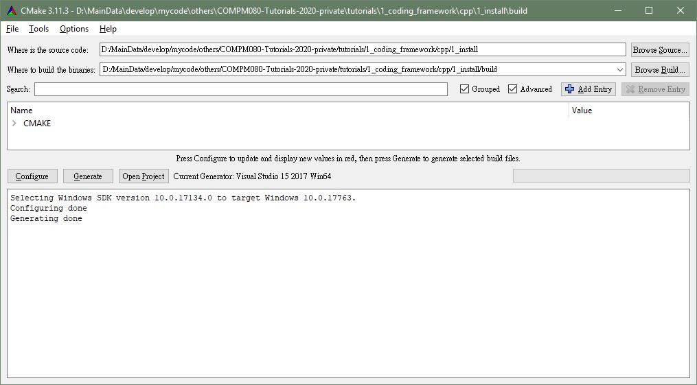

# C++ - Coding Framework

## Installation

### Windows 

1. download your preferred C++ IDE/Compiler. If you don't have a preference, we suggest you install Visual Studio.  
    [Visual Studio](https://visualstudio.microsoft.com )  
    
2. install git, git-extension, and cmake  
    + [git](https://git-scm.com/download/win)  
    + [git-extension, gui for git](https://github.com/gitextensions/gitextensions/releases/download/v3.00.00/GitExtensions-3.00.00.4433.msi)  
    + [cmake](https://github.com/Kitware/CMake/releases/download/v3.13.3/cmake-3.13.3-win64-x64.zip)  

### OSX 
1. use your package manager to install git, cmake, glew, and g++
2. Reference cmd:  
    * [Homebrew](http://brew.sh/)  
    `brew install git`  
    `brew install cmake`  
    `brew install glew`  
    `brew install gcc`  

    * [MacPorts](https://www.macports.org/)  
    `sudo port install cmake`  
    `sudo port install git`  
    `sudo port install glew`  
    `sudo port install gcc`  

### Linux 
1. use your package manager to install git, cmake, glew, and g++
2. Reference cmd(ubuntu):  
    
    `sudo apt-get install git build-essential cmake  libx11-dev  mesa-common-dev libgl1-mesa-dev libglu1-mesa-dev xorg-dev libglew-dev`  
    `sudo apt-get install cmake-gui`  
    
---
## Build Hello World Example
In this tutorial, we use CMake as a build tool. CMake is a universal cross-platform and cross-compiler building tool aim at simplifying the complex C++ environment set up problems.  
  
If you are unfamiliar with CMake, please read the section 1.1.1 in this page [what CMake can do](https://cgold.readthedocs.io/en/latest/overview/cmake-can.html  ).    

### LINUX/OSX 
1. cd to `COMPM080-Tutorials-2020\tutorials\1_coding_framework\cpp\1_install\src`
2. `mkdir build_debug`
3. `mkdir build_release`
4. create debug Makefile `cd build_debug; cmake .. -DCMAKE_BUILD_TYPE=Debug`  
    + build `make -j 4`  
5. create release Makefile `cd build_release; cmake .. -DCMAKE_BUILD_TYPE=Release`  
    + build `make -j 4`  
6. run  `./hello_world_bin`
    

### Windows

1. open CMake 
2. select src directory `COMPM080-Tutorials-2020\tutorials\1_coding_framework\cpp\1_install\src`
3. create and select a build directory 
4. press  
    a. Configure -> select Visual Studio 20XX **Win64** 
    b. Generate  
    c. Open Porject  
    
    
6. do compile in your IDE  
    (option) [select debug/releases mode]( https://docs.microsoft.com/en-us/visualstudio/debugger/how-to-set-debug-and-release-configurations?view=vs-2019 ) 
    
7. Build and Run (F5)
    [how to build and run]( https://docs.microsoft.com/en-us/cpp/build/vscpp-step-2-build?view=vs-2019 )

---
## How does CMake works?
### each CMake project directory must contain a CMakeLists.txt

\tutorials\1_coding_framework\cpp\1_install\CMakeLists.txt :
```
cmake_minimum_required(VERSION 3.1)
project(hello_world)

# set a variable
set(EXE_NAME ${PROJECT_NAME}_bin)

# collect xxx.cpp file  
file(GLOB SRCFILES src/*.cpp)

# add an executable to the project using the specified source files.
add_executable(${EXE_NAME} ${SRCFILES}) 

```


---
### What did you learn so far?
Set up a building environment and build a c++ code in both debug and release mode.  
Understand the basic syntax of CMakeFile.


