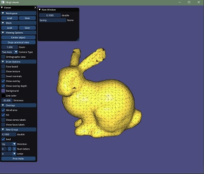
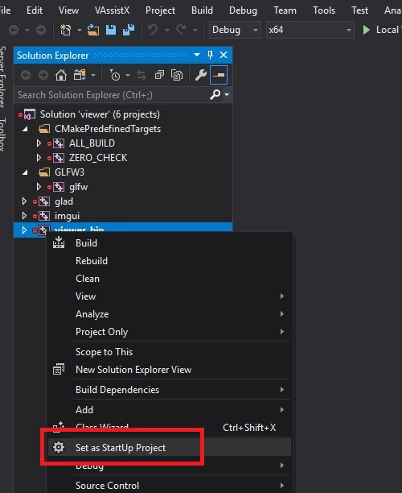

# C++ - Viewer

## What is LibIGL
LibIGL is a geometry processing library developed by [IGLLab](https://igl.ethz.ch/ ) in ETHZ. It provides rich geometry processing features, and it's easier to use compared to other C++ libraries (such as CGAL).  
As LibIGL uses [Eigen3](https://eigen.tuxfamily.org/) as its operation unit, it's highly optimized in most cases.  

Resources:
* [Eigen3 API references](https://eigen.tuxfamily.org/dox/group__QuickRefPage.html)
* [Eigen3 for matlab users](https://eigen.tuxfamily.org/dox/AsciiQuickReference.txt)
* [Libigl tutorials](https://libigl.github.io/tutorial/)
* [C++ template introduction](http://www.cplusplus.com/doc/oldtutorial/templates/)

If you are new to Eigen3, our introduction slides may help you to get started.  
C++ and Eigen3 Introduction: [ URL_HERE ]()  


## Install LibIGL
LibIGL is a submodule of this reposity and can be found at `\cpp_lib\libigl_c645aac0`  
[/.gitmodules](/.gitmodules)
  
Initial submodule  
`git submodule update --init --recursive`  
  
  

## Build LibIGL Viewer


To use a new library in your c++ project, it invokes the following steps:  
+ download and build a library
+ add the include directory into your project
+ link the library into your project

While configure these setting is tedious, many libraries ship their own 'FIND_XXX.cmake' file to simplify the building task. This magic macro file contains customized settings and option to allow various customization.

Lets configure libIGL through CMake. Our new CMakefile now look like:
[/tutorials/1_coding_framework/cpp/2_libigl/CMakeLists.txt](/tutorials/1_coding_framework/cpp/2_libigl/CMakeLists.txt)  
``` sh
cmake_minimum_required(VERSION 3.1)
project(viewer)


# set the directory of cmake macro file 
set(CMAKE_MODULE_PATH ${CMAKE_MODULE_PATH} ${CMAKE_CURRENT_SOURCE_DIR}/../../../../cmake)

# set libigl's magic options 
option(LIBIGL_WITH_OPENGL            "Use OpenGL"         ON)
option(LIBIGL_WITH_OPENGL_GLFW       "Use GLFW"           ON)
option(LIBIGL_WITH_OPENGL_GLFW_IMGUI   "Use GLFW_IMGUI"  ON )


# Ask cmake to find LibIGL use FindLIBIGL.cmake in CMAKE_MODULE_PATH
find_package(LIBIGL REQUIRED ) 

# print message
message(CMAKE_CURRENT_SOURCE_DIR=${CMAKE_CURRENT_SOURCE_DIR} )
message(found_LibIGL_include_dir=${LIBIGL_INCLUDE_DIR} )

# collect *.cpp files 
file(GLOB SRCFILES src/*.cpp)

# set binary name 
set(EXE_NAME ${PROJECT_NAME}_bin)
# add binary 
add_executable(${EXE_NAME} ${SRCFILES})

# link library
target_link_libraries(${EXE_NAME} PUBLIC  
        igl::core 
        igl::opengl 
        igl::opengl_glfw 
        igl::opengl_glfw_imgui 
)

# add include directory - use nanoflann as an example
target_include_directories( ${EXE_NAME}  PUBLIC
                           ${CMAKE_CURRENT_SOURCE_DIR}/../../../../cpp_lib/nanoflann
                          ) 
```
    
    
    
Reference CMake Configuring output  (windows)
```` cmake
Selecting Windows SDK version 10.0.17134.0 to target Windows 10.0.17763.
The C compiler identification is MSVC 19.14.26430.0
The CXX compiler identification is MSVC 19.14.26430.0
Check for working C compiler: D:/Program Files (x86)/Microsoft Visual Studio/2017/Community/VC/Tools/MSVC/14.14.26428/bin/Hostx86/x64/cl.exe
Check for working C compiler: D:/Program Files (x86)/Microsoft Visual Studio/2017/Community/VC/Tools/MSVC/14.14.26428/bin/Hostx86/x64/cl.exe -- works
Detecting C compiler ABI info
Detecting C compiler ABI info - done
Check for working CXX compiler: D:/Program Files (x86)/Microsoft Visual Studio/2017/Community/VC/Tools/MSVC/14.14.26428/bin/Hostx86/x64/cl.exe
Check for working CXX compiler: D:/Program Files (x86)/Microsoft Visual Studio/2017/Community/VC/Tools/MSVC/14.14.26428/bin/Hostx86/x64/cl.exe -- works
Detecting CXX compiler ABI info
Detecting CXX compiler ABI info - done
Detecting CXX compile features
Detecting CXX compile features - done
Found LIBIGL: D:/MainData/develop/mycode/others/COMPM080-Tutorials-2020-private/cpp_lib/libigl_c645aac0/include  
MSVC -> forcing use of statically-linked runtime.
Looking for pthread.h
Looking for pthread.h - not found
Found Threads: TRUE  

Creating target: igl::core (igl)
Creating target: igl::opengl (igl_opengl)

Found OpenGL: opengl32   
Creating target: igl::opengl_glfw (igl_opengl_glfw)

Using Win32 for window creation
Creating target: igl::opengl_glfw_imgui (igl_opengl_glfw_imgui)

found_LibIGL_include_dir=D:/MainData/develop/mycode/others/COMPM080-Tutorials-2020-private/cpp_lib/libigl_c645aac0/include

Configuring done

Generating done

````

For Windows and Visual Studio users, you need to set viewer_bin as the start-up project. 




