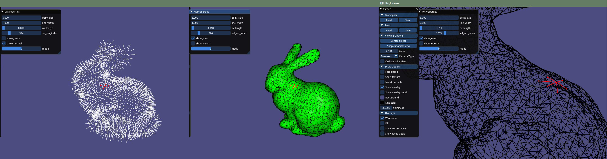

# C++ - Visualization



In this practice, we show how to use the LibIGL viewer to visualize points, edges, and a mesh as well as introduce some neighboring access functions.  

First, set up and build the example project in this directory following the previous practices.  
After you successfully built this project, you should be able to see a GUI viewer running.  

---
## Draw 
we provide some draw functions. Check the main.cpp in this example project to see how it work.  
  
### Draw Points
``` cpp
void add_points(igl::opengl::glfw::Viewer& viewer, Eigen::MatrixXd const  & pts_n3, Eigen::RowVector3d const  & color )
```
  
### Draw Edges
``` cpp
void add_edges(igl::opengl::glfw::Viewer& viewer, Eigen::MatrixXd const &  p0, Eigen::MatrixXd const  & p1, Eigen::MatrixXd const &  color)
```

### Draw Mesh 
``` cpp
void add_mesh(igl::opengl::glfw::Viewer& viewer, Eigen::MatrixXd const &  V, Eigen::MatrixXi const & F, Eigen::MatrixXd const & color)
```

---
## USE LibIGL

Usually, you can find the API LibIGL's function at its header file. For example, the spec. of `igl::readOBJ` can be found at [include/igl/readOBJ.h](https://github.com/libigl/libigl/blob/508cb9940f4d1e8e54137d5afe2fd2eb9c4dc672/include/igl/readOBJ.h#L44  ). 
In the following, we show some examples.  

### (1) Load Mesh  
  
  `Eigen::MatrixXd V;`  
  `Eigen::MatrixXd F;`  
  `igl::readOBJ(filename, V,F);`  
[readOBJ](https://github.com/libigl/libigl/blob/508cb9940f4d1e8e54137d5afe2fd2eb9c4dc672/include/igl/readOBJ.h#L44  )
  
  
### (2) Vertex normal  
  
`igl::per_vertex_normals(V,F,N)`  
  [per_vertex_normals](https://github.com/libigl/libigl/blob/508cb9940f4d1e8e54137d5afe2fd2eb9c4dc672/include/igl/per_vertex_normals.h  )
  

### (3) Vertex adjacent matrix 
To access neighboring vertics, we use LibIGL's `igl::vertex_triangle_adjacency`  to build a adjacent matrix  
  
`igl::vertex_triangle_adjacency(V.rows(),F, VF, VI )`  

API:  
[include/igl/vertex_triangle_adjacency.h ](https://github.com/libigl/libigl/blob/master/include/igl/vertex_triangle_adjacency.h#L57  )

``` cpp
// vertex_face_adjacency constructs the vertex-face topology of a given mesh (V,F)
// 
// Inputs:
//   n  number of vertices #V (e.g. `F.maxCoeff()+1` or `V.rows()`)
//   F  #F by dim list of mesh faces (must be triangles)
//
// Outputs:
//   VF  #V list of lists of incident faces (adjacency list)
//   VI  #V list of lists of index of incidence within incident faces listed in VF
//
//
```

The neighboring vertices of a vertex v_i can be retrieved using a loop.  

``` cpp
    int sel_vidx=0;
    
    std::vector<std::vector<int> > VF;
    std::vector<std::vector<int> > VFi;
    
    igl::vertex_triangle_adjacency( V.rows(), F, VF, VFi);
    
    // adjacent vertices of V[sel_vidx]
    int num_of_adj_vertices=VF[sel_vidx].size()*2;
    
    Eigen::MatrixXd adj_vex;
    adj_vex.resize(num_of_adj_vertices, 3);

    int count = 0;
    
    // get adjacent faces & vertices
    for (size_t i = 0; i < VF[sel_vidx].size(); i++)
    {
      int face_idx = VF[sel_vidx][i];
      int v_local_idx = VFi[sel_vidx][i];

      for (int iv = 0; iv < 3; iv++)
      {
        if (iv != v_local_idx)
        {
          Eigen::RowVector3d const vex = V.row(F(face_idx, iv));
          adj_vex.row(count) = vex;
          count++;
        }
      }
    } 

````
---


